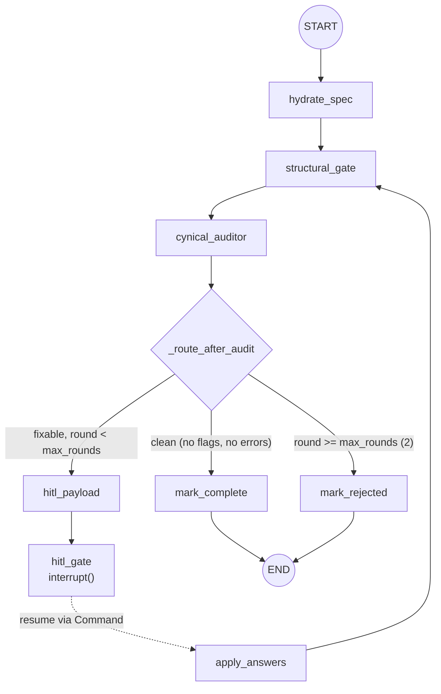

# Block B — Formulation Engine: Full Architecture Graph

> Backend-only. Consumes Block A's curated A6 `ExecutableStrategySpec` and
> produces backtest-ready **formulations**: complete entry/exit/sizing triples
> with a designed parameter sweep grid, gated by a human-in-the-loop (HITL)
> card layer and a native self-extending component library (`strategylib`).
>
> Stratification: **API → DAG → Nodes → Engine → strategylib**, plus a
> **Persistence** stratum for restart resilience. Everything is frozen into an
> API contract and a `StrategyState` schema (single source of truth).

---

## 0. Legend

| Symbol | Meaning |
|---|---|
| `node: name` | One LangGraph node (plain function over `StrategyState`) |
| `└──►` | Normal graph edge (fires automatically) |
| `- -►` | Resume edge (fires only when the graph is resumed with a `Command`) |
| `◎ END` | Terminal node (`mark_complete` / `mark_rejected`) |
| `# comment:` | Per-compartment annotation — the *why* behind each box |
| `(read/write →)` | State fields a compartment consumes / produces |

Status machine (who sets what):

```
idle ──submit──► auditing ──router──► complete │ rejected
                     │
                     └──► hitl ──resume──► auditing (round+1) ──► ...
```

`idle / extracting / building / llm_failed` exist in the `StrategyState.status`
literal for future stages; Block B's nodes set only `auditing / hitl /
complete / rejected`.

---

## 1. Top-level diagram (GitHub-rendering Mermaid)



---

## 2. The annotated graph — one comment per compartment

```
┌───────────────────────────────────────────────────────────────────────────┐
│ START                                                                     │
│   POST /api/v1/strategy/submit → new StrategyState{status: idle, spec: A6}│
│ # comment: the ONLY entry point. A session is a thread_id; the graph has  │
│ # zero cross-session memory (fresh MemorySaver per compiled graph reuse,   │
│ # fresh thread per submission). Spec comes inline or via spec_id (A6 JSON).│
└──────────────────────────────┬────────────────────────────────────────────┘
                               ▼
┌───────────────────────────────────────────────────────────────────────────┐
│ node: hydrate_spec                                                        │
│   state/nodes.py → block_b/formulation.hydrate_spec(spec)                 │
│ # comment: FORMULATION — turns the A6 spec into ≤ MAX_VARIANTS(4)         │
│ # variants, each an entry×exit×sizing triple plus a designed sweep grid   │
│ # (grids come from component manifest param schemas — Block A params      │
│ # carry intent, not bounds). Emits structural_errors: missing_pillar,     │
│ # bad_data, grid_bounds. Empty spec ⇒ synthetic bad_data error.           │
│ # reads: spec            writes: variants, structural_errors, status      │
└──────────────────────────────┬────────────────────────────────────────────┘
                               ▼
┌───────────────────────────────────────────────────────────────────────────┐
│ node: structural_gate                                                     │
│   block_b/formulation.structural_gate(state)                              │
│ # comment: DETERMINISTIC WELL-POSEDNESS GATE — re-runs on EVERY pass      │
│ # (hydration AND after each HITL resume), and OVERWRITES the full error   │
│ # set, so an approved missingPrimitive registration or a patched pillar   │
│ # clears its error on the next pass naturally. Checks: data binding,      │
│ # unbacked primitives (vocabulary w/o executable component), unresolvable │
│ # pillar component ids, grid sanity (lo<hi, step>0, default∈[lo,hi]).     │
│ # reads: spec, variants    writes: structural_errors, status              │
└──────────────────────────────┬────────────────────────────────────────────┘
                               ▼
┌───────────────────────────────────────────────────────────────────────────┐
│ node: cynical_auditor                                                     │
│   block_b/auditor.audit_variants(state)                                   │
│ # comment: ADVERSARIAL WELL-POSEDNESS — asks ONLY "can this be evaluated  │
│ # honestly?", never "is it profitable" (that is Block C's job).           │
│ # Findings: lookahead_bias (critical), missing_exit / no_sizing (high),   │
│ # degenerate_window (high), unbounded_param (medium). Deterministic v1 —  │
│ # an LLM-backed pass is the documented upgrade, a node-internal swap.     │
│ # reads: spec, variants    writes: audit_flags, iteration_count(+1)       │
└──────────────────────────────┬────────────────────────────────────────────┘
                               │
                 ┌─────────────▼─────────────┐
                 │ _route_after_audit        │  <-- ConditionalEdge
                 │ (state/graph.py)          │
                 │ # comment: THE DECISION    │
                 │ # POINT. clean → complete;│
                 │ # fixable & round<2 → hitl│
                 │ # → rejected after cap.  │
                 └──────┬──────────┬─────────┘
        clean           │          │ fixable & round < max_rounds(2)
        ┌───────────────┘          └───────────────┐
        ▼                                          ▼
┌──────────────────────────────┐   ┌────────────────────────────────────────┐
│ mark_complete                │   │ node: hitl_payload                     │
│ # comment: terminal success; │   │   block_b/hitl.build_cards(state)      │
│ # formulation validated,     │   │ # comment: builds the typed card batch │
│ # ready for Block C.         │   │ # from structural_errors + audit_flags │
│ # writes: status=complete    │   │ # → missingPillar / missingPrimitive / │
└──────────────┬───────────────┘   │ # remediation / universe cards, ids    │
               │                    │ # C-R{round}-NNN, deduped by mutation.│
               │                    │ # reads: errors+flags+variants        │
               │                    │ # writes: hitl_cards, status=hitl     │
               │                    └──────────────┬─────────────────────────┘
               │                                   ▼
               │                    ┌────────────────────────────────────────┐
               │                    │ node: hitl_gate                        │
               │                    │   langgraph.types.interrupt()          │
               │                    │ # comment: THE INTERRUPT — the graph   │
               │                    │ # parks HERE until a human answers.    │
               │                    │ # Payload: {type: hitl_request, round, │
               │                    │ # cards}. Resume injects Command(      │
               │                    │ # resume={answers:{card_id:{action,    │
               │                    │ # value}}}) → stored as user_responses.│
               │                    │ # NEVER increments round (see C7).     │
               │                    └──────────────┬─────────────────────────┘
               │                                   │ - - resume - -
               │                                   ▼
               │                    ┌────────────────────────────────────────┐
               │                    │ node: apply_answers                    │
               │                    │   block_b/hitl.apply_answers(state)    │
               │                    │ # comment: deterministic KEYED MUTATION │
               │                    │ # merge — card_id → {action, value} →  │
               │                    │ # apply via dotted mutation paths      │
               │                    │ # (variants.0.sizing …). Idempotent:    │
               │                    │ # appl already-applied ids are skipped;│
               │                    │ # resume_key = sha1(answers batch).    │
               │                    │ # round += 1 ONLY when applied_any.    │
               │                    │ # writes: variants/spec diffs,         │
               │                    │ # answers_applied, resume_key, round   │
               │                    └──────────────┬─────────────────────────┘
               │                                   │
               │                                   │ (re-audit loop)
               │                                   └────────────► structural_gate
               ▼
┌──────────────────────────────┐
│ mark_rejected                │
│ # comment: terminal failure; │
│ # round cap (2) exhausted —  │
│ # flaws persist after HITL.  │
│ # writes: status=rejected    │
└──────────────┬───────────────┘
               │
          ┌────▼────┐
          │ ◎ END   │
          └─────────┘
```

### Edge summary (exact wiring, `state/graph.py`)

| # | Edge | Kind | Trigger |
|---|---|---|---|
| 1 | `START → hydrate_spec` | plain | always |
| 2 | `hydrate_spec → structural_gate` | plain | always |
| 3 | `structural_gate → cynical_auditor` | plain | always |
| 4 | `cynical_auditor → {mark_complete \| hitl_payload \| mark_rejected}` | **conditional** | `_route_after_audit` |
| 5 | `hitl_payload → hitl_gate` | plain | always (interrupt fires) |
| 6 | `hitl_gate → apply_answers` | plain | only on **resume** (interrupt returns answers) |
| 7 | `apply_answers → structural_gate` | plain | re-audit loop |
| 8 | `mark_complete → END` / `mark_rejected → END` | plain | terminal |

Cap mechanics (important): `round`/`max_rounds=2` are enforced **on the
ConditionalEdge**, not by the graph-level `max_iterations` dead-man (a parked
HITL stream would trip that). `max_iterations=2` exists only as the
synthesis-retry bound inside nodes (dead-man safety).

---

## 3. Compartment-by-compartment detail

### C1 — API stratum  `api/strategy_routes.py` + `schemas.py` (Block B part)

Frozen REST contract. Module-level `_graph = create_strategy_graph()` (one
compiled graph, `MemorySaver` in-process checkpointer).

| Endpoint | Behavior | Comments |
|---|---|---|
| `POST /api/v1/strategy/submit` (201) | resolve spec (inline `spec` validated through `ExecutableStrategySpec.model_validate` + `model_dump(mode="json")`, or `spec_id` looked up in `out/block_a_specs.json`; 404 if missing, 422 if neither) → new thread → `_graph.invoke` to first interrupt (swallows `GraphInterrupt`) → `save_state` → `_payload` | **409** if the session_id already exists |
| `GET /api/v1/strategy/{id}/state` | `_ensure(sid)` → live checkpoint, else disk snapshot + `replay_park` → `_payload` | 404 if no session anywhere |
| `GET /api/v1/strategy/{id}/stream` | SSE replay of finished supersteps: `formulation` (payload), then `hitl_request` (round+cards) if `status=hitl`, then `done` if terminal | Sync DAG ⇒ snapshot stream, not live push (documented ceiling) |
| `POST /api/v1/strategy/{id}/resume` | **idempotency first**: `sha1(sort_keys json(answers)) == state.resume_key` → return current payload (no graph re-invoke). Then 409 if `status != "hitl"`. Else `_graph.invoke(Command(resume={"answers": …}))` (swallows 2nd-round `GraphInterrupt`) → `save_state` → `_payload` | Idempotency check sits **before** the 409 status check |

`_payload(state)` is the stable response contract: `session_id, status, round,
variants, hitl_cards, structural_errors, audit_flags, answers_applied`.

Request models (`schemas.py`):
- `StrategySubmitRequest` — `spec_id: str | None` xor `spec: dict | None` (exactly one).
- `StrategyResumeRequest` — `answers: dict[card_id, {"action": "accept|override|reject|approve", "value": …}]`.

### C2 — DAG stratum  `state/graph.py`

`build_graph()` wires the 8 nodes + 8 edges above, compiles against a
checkpointer (MemorySaver default). `create_strategy_graph()` is the module
singleton the API uses. `replay_park` (below, C9). Router `_route_after_audit`
is exported and unit-tested directly.

### C3 — Node stratum  `state/nodes.py`

Thin wrappers — all logic lives in `block_b` so it is testable **without** the
graph. Each returns only msgpack-safe primitives. Shared helpers:
`get_initial_state(session_id)` (fresh `StrategyState`, uuid thread) and
`state_from_checkpoint(saved)` (checkpoint dict/StateTuple → `StrategyState`).

Per-node write-set (verified against code):

| Node | Writes |
|---|---|
| `hydrate_spec` | `structural_errors` (or synthetic `bad_data` when no spec), `status` |
| `structural_gate` | `structural_errors` (full set, overwrite), `status` |
| `cynical_auditor` | `audit_flags`, `iteration_count (+1)`, `status` |
| `hitl_payload` | `hitl_cards`, `status=hitl` |
| `hitl_gate` | `user_responses` (only when resumed) |
| `apply_answers` | `variants`/`spec` diffs, `answers_applied`, `resume_key`, `round (+1 iff applied_any)`, `status` |
| `mark_complete` / `mark_rejected` | `status` |

### C4 — State container  `state/schema.py` (single source of truth)

Msgpack-safe Pydantic (`extra="forbid"`); the TS mirror
`frontend/src/app/strategy/strategy-state.ts` tracks it (contract-first).

| Field | Role | Set by |
|---|---|---|
| `session_id` | thread identity | submission |
| `status` | `idle…rejected` machine | every node |
| `spec` | the A6 `ExecutableStrategySpec` being formulated | submission / universe card |
| `variants` | ≤4 formulation triples + grids | hydrate / apply_answers |
| `structural_errors` | gate findings | hydrate-spec + structural_gate |
| `audit_flags` | auditor findings (AuditFlag contract) | cynical_auditor |
| `hitl_cards` | current pending card batch | hitl_payload |
| `answers_applied` | card ids already merged (idempotence) | apply_answers |
| `user_responses` | `card_id → {action, value}` from resume | hitl_gate |
| `resume_key` | sha1 of last applied answers batch | apply_answers |
| `round` / `max_rounds` | HITL rounds completed / cap (2) | apply_answers / config |
| `iteration_count` / `max_iterations` | monotonic stage counter / dead-man (2) | cynical_auditor / config |

### C5 — Formulation engine  `block_b/formulation.py`

Pure + deterministic (no LLM in the pre-audit path).

- `MAX_VARIANTS = 4`. `_TRIGGER_TO_EXIT` maps A6 triggers to exit components
  (`TRIGGER_CROSS_*`→`exit.atr_stop`, `TRIGGER_BAND_BREAKOUT`→`exit.time_exit`).
- `referenced_primitives(spec)` — triggers/indicators/filters/secondary signal
  + AST operand ids, walked via `_walk_ast_ids`.
- `unbacked_primitives(spec)` — referenced ids minus known feeds/transforms
  (`_KNOWN_FEEDS`, `_KNOWN_TRANSFORMS` imported from synthesize) minus
  registry-backed implements. **The trigger for the `missingPrimitive`
  synthesis path.**
- `_pillar_grid(component)` — designs the sweep surface: per manifest param,
  `{default, lo(min), hi(max), step=(hi-lo)/5 clamped ≥ 1e-9}`.
- `pillar_payload(component)` — `{component_id, params: defaults, grid}`.
  **Public** because the HITL `accept` path re-derives the FULL payload from it
  (keeps the sweep surface consistent everywhere it is built).
- `_candidates(pillar, trigger, fallback)` — trigger-aware candidates first,
  pillar fallbacks after, deduped, stable order.
- `hydrate_spec(spec)` — builds `min(MAX_VARIANTS, max(len(entry_options),
  len(exit_options)))` variants; sizing comes from spec params when present,
  else `None` (which becomes a `missing_pillar` error → HITL card proposes
  `sizing.fractional`). Emits `missing_pillar`, `grid_bounds`, `bad_data`.
- `_data_errors(spec)` — symbol/timeframe binding + timeframe ∈ `DataGranularity`.
  Reused by hydration AND the gate (the gate owns the FULL error set each pass).
- `_grid_bounds_errors(variant)` — `lo < hi`, `step > 0`, `default ∈ [lo, hi]`.
- `structural_gate(state)` — the full per-pass error set: `_data_errors` +
  `unbacked_primitive` + `missing_pillar`/unregistered component per pillar +
  grid sanity.

### C6 — Cynical Auditor  `block_b/auditor.py`

Deterministic v1, `audit_variants(state)` per variant:
`_audit_pillars` (missing_exit high, no_sizing high, degenerate_window high iff
`entry.ema_cross` with `slow ≤ fast`), `_audit_grid` (unbounded_param medium iff
a sweep entry lacks `lo`/`hi`), `_audit_lookahead` (critical — walks the signal
AST for `lag`/`returns` with a **negative** literal shift via `_find_lead`).

Never judges profitability — that is Block C. AuditFlag contract is stable so
the LLM pass can drop in later without touching graph topology.

### C7 — HITL layer  `block_b/hitl.py`

- `build_cards(state)` — structural errors → `_pillar_card` / `_primitive_card`
  / `_universe_card`; audit flags → `_remediation_for_flag`. Card ids assigned
  `C-R{round}-NNN`, then `_dedupe` keeps one card per mutation path.
- `_card(...)` shared constructor (single skeleton — ponytail consolidation).
- Card types & mutation semantics:

| type | source | mutation path | options | apply-on-resume |
|---|---|---|---|---|
| `missingPillar` | gate | `variants.{i}.{pillar}` | registry component ids | accept/override → **full `pillar_payload`** re-derived |
| `missingPrimitive` | gate (unbacked) | `""` (registration) | `synthesize`, `abandon` | `approve`/`accept` + preview w/o error → `append_manifest` |
| `remediation` | auditor | varies (below) | `accept`/`override`, or `accept`/`reject` for lookahead | keyed mutation |
| `universe` | gate (`bad_data`) | `"spec"` (symbol/timeframe) | none (proposal) | patches `spec.target_asset/timeframe` |
| `riskOverride` | (reserved) | — | — | future |

- `_remediation_for_flag` mapping: `missing_exit`→`variants.{i}.exit` /
  `exit.atr_stop`; `no_sizing`→`variants.{i}.sizing` / `sizing.fractional`;
  `unbounded_param`→`variants.{i}.{pillar}.grid.{name}` with bounds *derived
  from the component default* (`default*0.5 … default*2.0`, step `/5`);
  `degenerate_window`→`variants.{i}.entry.params` `{fast:10, slow:40}`;
  `lookahead_bias`→**no auto-fix**, `accept`/`reject`, empty mutation (honest
  v1: the flaw persists until the round cap rejects — never silently healed).
- `_primitive_card` — runs `synthesize_component` (writes the generated module,
  does **NOT** append the manifest) and embeds the result as a preview. A
  self-check failure ⇒ `{"error": …}` preview ⇒ card is NOT approvable (honest
  v1 behavior).
- `apply_answers(state)` — idempotent merge: skips card ids already in
  `answers_applied`; only emits `variants`/`spec` when they actually changed;
  sets `resume_key`; returns `applied_any` which the `apply_answers` **node**
  uses to decide `round += 1` (a no-op duplicate resume never burns a round).
- `_apply_one` — `missingPrimitive` approve → `append_manifest(entry)`;
  `universe` → patch spec; generic → dotted `_set_path` into variants or spec;
  **accept/override with a `component_id` value targeting entry/exit/sizing
  re-derives the full `pillar_payload`** (a raw id would leave no sweep surface
  for Block C).
- `_target` / `_set_path` / `_deepcopy` (json round-trip) helpers.
- `save_state` / `load_state` — JSON snapshot per session.

### C8 — strategylib  `strategylib/` (native, self-extending)

```
components/            (6 curated modules + _math.py)
_backend.py            (array backend: CuPy/[GPU] primary, NumPy CPU fallback)
manifest.json          (index only — version 1.0.0, trust tiers, contract)
registry.py            (Component dataclass, resolve/by_pillar/matching/append_manifest)
synthesize.py          (interpret, synthesize_component, generate_from_primitive, self-check)
components/generated/  (synthesized modules, written at HITL preview time)
```

- **Array backend** — `_backend.py` runs every component + interpreter op on
  **CuPy (GPU)** when a CUDA device exists; NumPy is kept only as an
  import-time fallback so the package still imports on CUDA-less CI/dev
  machines (manifest contract is backend-agnostic). A few numpy idioms are
  shimmed for cupy: `where=` ufunc kwarg → guarded-denominator `np.where`,
  `np.insert` → `concatenate((zeros(1), …))`, `rng.normal` → `mu +
  standard_normal()`.
- **Manifest index** — 6 curated components: `entry.ema_cross`,
  `entry.vwap_band`, `exit.atr_stop`, `exit.time_exit`, `sizing.fractional`,
  `sizing.atr_scaled`. Contract block pins the `compute(data, params) →
  np.ndarray` signature and data keys; `trust: curated`.
- **registry.py** — `Component` (frozen dataclass) with `compute()` dispatching
  via `importlib` on `impl: "module:function"`. `load_registry` (lru_cache, 8) is
  pure so tests can point at alternate manifests. `append_manifest` is
  **idempotent** (skips existing ids) and clears the cache. Novel components are
  only registered after human `approve`.
- **synthesize.py** — `interpret(node, data, params)` is the **single
  interpreter** over `GenericPrimitiveNode` (validated through a
  `TypeAdapter`), reused by every generated module (ponytail: one interpreter,
  not one per module). `synthesize_component(...)` writes
  `components/generated/<module>.py` (provenance header + embedded AST +
  `compute` delegating to `interpret`), builds the manifest entry
  (`trust: paper_derived`, `params: {}` — library defaults apply until param
  refinement), then runs the **hermetic self-check** (`_self_check`: import +
  output shape `(n,)` + all finite on synthetic data, `rng(0)`); failure ⇒
  `ValueError`, no registration. `generate_from_primitive` backstops a
  bare operand with the trivial pass-through feed (honest fallback).
- **Trust tiers** — `curated` (shipped, reviewed) vs `paper_derived`
  (synthesized, human-approved).

### C9 — Persistence & restart  `strategy_routes.py` + `graph.replay_park` + `hitl.save/load_state`

Two layers, in-process live path + disk safety net:

1. **Live path**: MemorySaver checkpointer holds the parked thread.
2. **Disk snapshot**: `out/strategy/<session_id>.json` written on submit and
   on every resume (`save_state`).
3. **Restart recovery**: `_ensure()` finds no live thread → `load_state` →
   `StrategyState.model_validate` → if `status == "hitl"`, `replay_park(graph,
   persisted, thread_id)` re-invokes the **deterministic pre-audit chain** with
   `interrupt_after="hitl_gate"`, reproducing the identical parked cards with
   `round` preserved (`hitl_payload` never increments round — only
   `apply_answers` does), then the live thread is used again. `GraphInterrupt`
   is expected and swallowed.

---

## 4. Router decision table  (`_route_after_audit`)

| audit_flags | structural_errors | round vs max_rounds | Route | Terminal? |
|---|---|---|---|---|
| ∅ | ∅ | any | `mark_complete` | ✅ complete |
| any | any | `round < 2` | `hitl_payload` → interrupt | ⏸ parked |
| any | any | `round ≥ 2` | `mark_rejected` | ✅ rejected |

---

## 5. Lifecycle walkthroughs

**A. Happy path** — `submit` → hydrate (4 variant triples, 0 errors) → gate
(clean) → auditor (clean) → `mark_complete`. `stream`: `formulation` +
`done`. Variants carry `source: block_a`.

**B. One HITL round** — auditor flags `no_sizing` (variant 0). Round 0 →
`hitl_payload` → card `C-R0-001` (`remediation`, mutation `variants.0.sizing`,
options `accept/override`). `resume {C-R0-001: {action: accept}}` →
`apply_answers` re-derives `sizing.fractional` full payload, `round → 1` →
`structural_gate` → auditor → clean → `mark_complete`.

**C. Stubborn flaw → rejection** — auditor flags `lookahead_bias`
(no auto-fix). Round 0 card → resume (accept) → `round → 1` → re-audit still
flags → round 1 card → resume → `round → 2` → re-audit still flags →
`round ≥ max_rounds` → `mark_rejected`. Honest v1: no silent healing.

**D. Process restart while parked** — next `GET …/state` or `POST …/resume`
calls `_ensure` → disk snapshot → `replay_park` → thread parked again at
`hitl_gate` with the same cards; resume works exactly as before.

## 6. Idempotency contract

- `POST /resume` returns the current payload without re-invoking the graph
  when `sha1(canonical answers) == state.resume_key` (checked **before** the 409
  status check).
- `apply_answers` skips card ids already in `answers_applied` → a duplicated
  batch is a graceful no-op and never advances `round`.
- `append_manifest` skips already-registered component ids.

## 7. Test map (176 passing)

| File | Covers |
|---|---|
| `tests/test_block_b.py` | engine units (`hydrate_spec`, `structural_gate`, `pillar_payload`, `unbacked_primitives`), cards + `apply_answers` (accept/idempotent/approve), graph lifecycle (complete / hitl-resume / rejected-2-rounds / `replay_park`), API contract incl. `spec_id` resolution + resume idempotency |
| `tests/strategylib/test_components.py` | component numeric self-checks, registry, `interpret`, synthesize-to-tmp, `append_manifest` idempotence |

## 8. Deliberately-cut corners (ponytail)

- Rule-based auditor/structural gate: LLM pass = node-internal swap, contract
  unchanged (`auditor.py`).
- Synthesized component `params` stay empty; library defaults apply until Block
  B param refinement wires paper values (`synthesize.py`).
- One shared `interpret` for all generated modules — no per-module interpreter.
- SSE stream is a snapshot replay (sync DAG); live per-node push lands with
  async graph runs.
- PG checkpointing (real thread persistence) is the documented upgrade path over
  the JSON-snapshot + `replay_park` scheme.